# BUG REPORT

- Student name: Dương Gia Huy
- Student ID: 23127052

---

## Feature 1: FR-04: Quản lý hồ sơ cá nhân

### Bug 1: Sai logic xác thực độ dài số điện thoại khi cập nhật hồ sơ (Đặc tả nhận 10-11 số, thực tế chỉ nhận 9-10 số)
- **Mô tả Bug:**
Theo đặc tả hệ thống (FR-04), số điện thoại hợp lệ phải có độ dài từ 10 đến 11 chữ số. Tuy nhiên, hiện tại hệ thống chỉ chấp nhận SĐT từ 9 đến 10 chữ số và hiển thị thông báo lỗi không chính xác từ đó dẫn đến việc người dùng không thể cập nhật SĐT hợp lệ có 11 số, và SĐT 10 số cũng bị bắt lỗi một cách bất thường.

- **Test Case liên quan:**
    - `TC_FR04_01`
    - `TC_FR04_02`
    - `TC_FR04_03`
    - `TC_FR04_04`

- **Github Issues Link:** https://github.com/nguyenhieuthuan3105/EShop-Testing-HW02-Group04/issues/46
- **Ảnh minh chứng (Screenshots):**
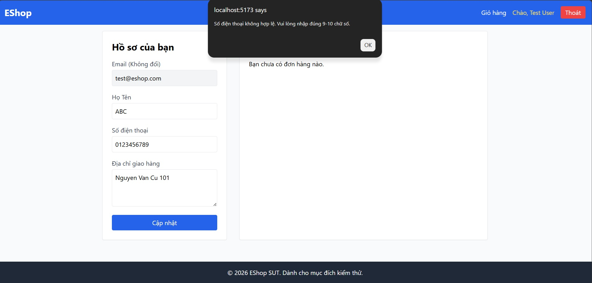

### Bug 2: Hệ thống chấp nhận lưu số điện thoại không bắt đầu bằng số 0
- **Mô tả Bug:**
Theo đặc tả hệ thống (FR-04), số điện thoại hợp lệ phải bắt đầu với số 0. Tuy nhiên, hiện tại hệ thống đang thiếu logic xác thực hoặc thậm chí là sai logic xác thực như đã báo cáo trong `Bug 1`, các số điện thoại bắt đầu bằng số 0 hệ thống đều không chấp nhận. Ngược lại người dùng có thể nhập các số điện thoại bắt đầu bằng chữ số khác (Ví dụ: 8, 9...) và hệ thống vẫn chấp nhận, báo thành công và lưu trực tiếp vào cơ sở dữ liệu.

- **Test Case liên quan:**
    - `TC_FR04_05`

- **Github Issues Link:** https://github.com/nguyenhieuthuan3105/EShop-Testing-HW02-Group04/issues/47
- **Ảnh minh chứng (Screenshots):**
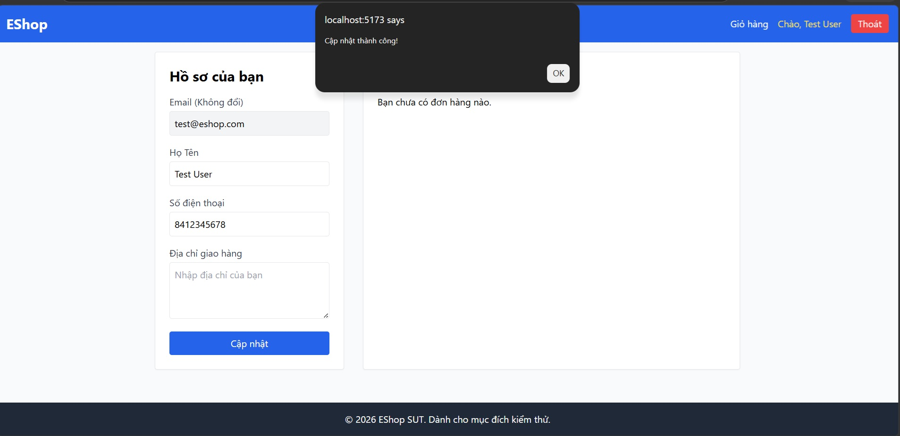

### Bug 3: Hiển thị chung một thông báo lỗi sai ngữ cảnh cho mọi thao tác nhập liệu không hợp lệ tại trường số điện thoại
- **Mô tả Bug:**
Hệ thống hiện đang sử dụng một thông báo lỗi dùng chung cho mọi trường hợp nhập liệu không hợp lệ tại trường "Số điện thoại". Bất kể người dùng bỏ trống, nhập chữ cái/ký tự đặc biệt, hay nhập sai đầu số, hệ thống đều trả về duy nhất một câu thông báo: "Số điện thoại không hợp lệ. Vui lòng nhập đúng 9-10 chữ số" (sai lệch so với đặc tả - giới hạn độ dài chỉ từ 10 - 11 số).

- **Test Case liên quan:**
    - `TC_FR04_01`
    - `TC_FR04_02`
    - `TC_FR04_03`
    - `TC_FR04_04`
    - `TC_FR04_06`
    - `TC_FR04_07`

- **Github Issues Link:** https://github.com/nguyenhieuthuan3105/EShop-Testing-HW02-Group04/issues/48
- **Ảnh minh chứng (Screenshots):**
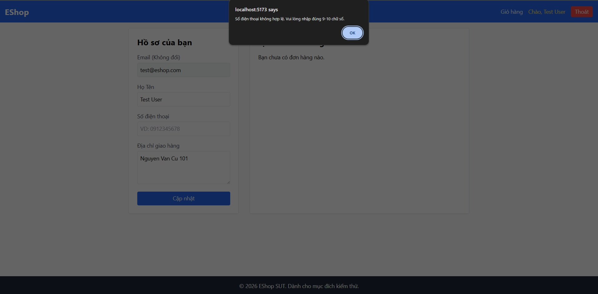
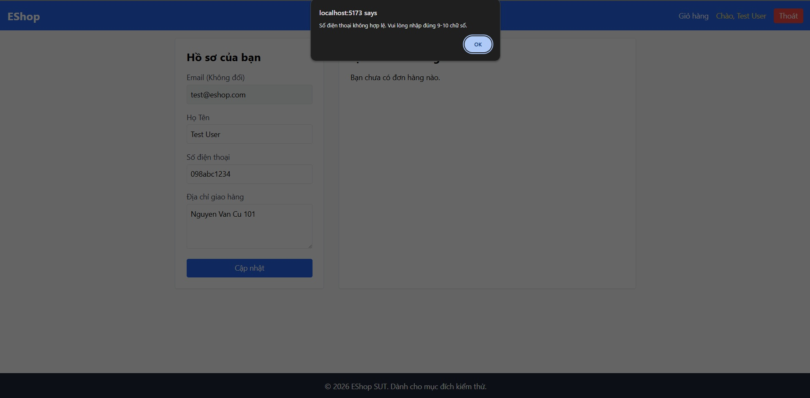

### Bug 4: Người dùng có thể tự nâng quyền thành Admin qua API cập nhật hồ sơ (Mass Assignment)
- **Mô tả Bug:**
Hệ thống đang mắc phải lỗ hổng bảo mật nghiêm trọng Mass Assignment, khi người dùng gọi API cập nhật hồ sơ cá nhân và cố tình chèn thêm thuộc tính phân quyền (`"role": "admin"`) vào payload request, Backend đã không thực hiện kiểm soát và lọc dữ liệu đầu vào mà trực tiếp lưu toàn bộ payload nhận được vào cơ sở dữ liệu, dẫn đến việc một tài khoản thông thường (user) có thể tự nâng đặc quyền của mình lên quản trị viên (admin) trái phép.

- **Test Case liên quan:**
    - `TC_FR04_09`

- **Github Issues Link:** https://github.com/nguyenhieuthuan3105/EShop-Testing-HW02-Group04/issues/49
- **Ảnh minh chứng (Screenshots):**
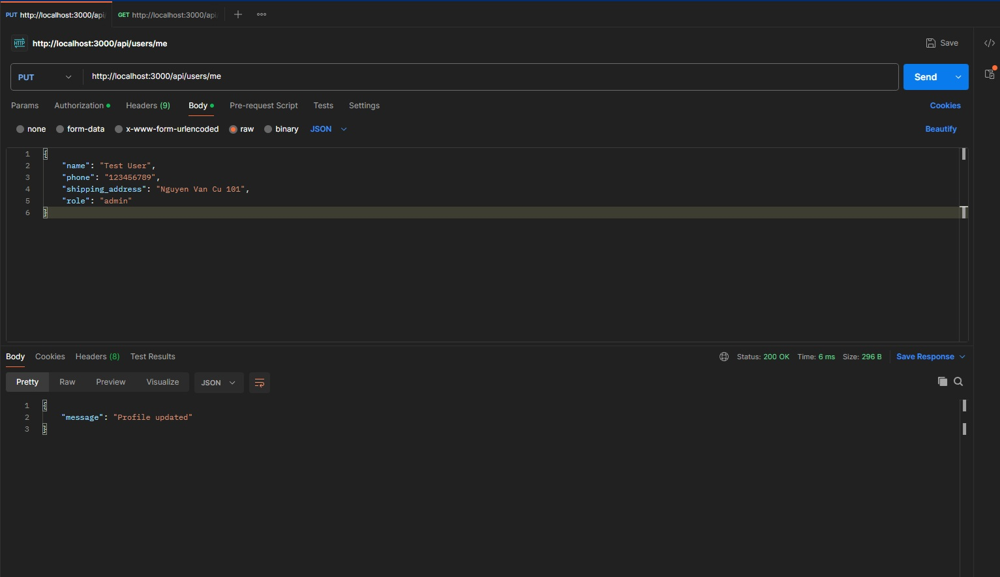
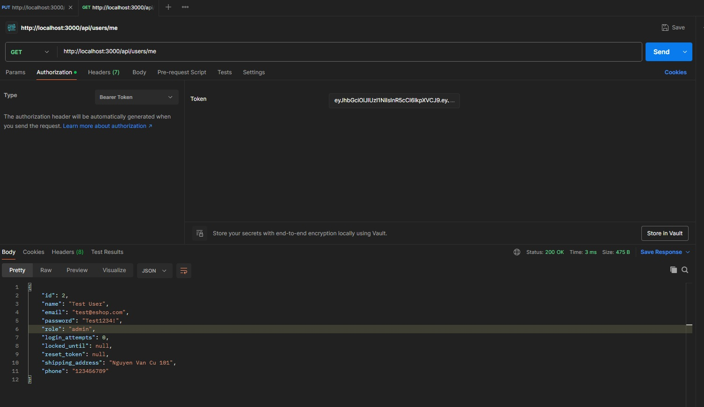

### Bug 5: Thiếu hình minh họa khi giao diện Giỏ hàng ở trạng thái trống
- **Mô tả Bug:**
Theo đặc tả hệ thống (FR-07), khi người dùng truy cập vào giỏ hàng nhưng chưa có sản phẩm nào, hệ thống bắt buộc phải hiển thị kết hợp cả thông báo bằng chữ và hình ảnh minh họa trạng thái trống. Tuy nhiên, hiện tại giao diện chỉ hiển thị duy nhất dòng chữ "Giỏ hàng của bạn đang trống", hoàn toàn thiếu đi hình ảnh minh hoạ.

- **Test Case liên quan:**
    - `TC_FR07_01`

- **Github Issues Link:** https://github.com/nguyenhieuthuan3105/EShop-Testing-HW02-Group04/issues/54
- **Ảnh minh chứng (Screenshots):**
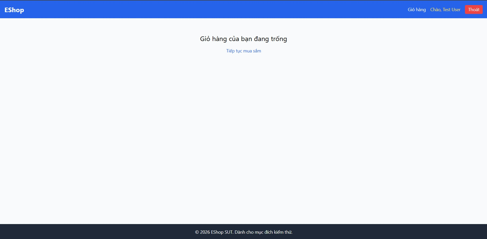

### Bug 6: Giao diện giỏ hàng thiếu nút tăng/giảm (+/-) tại cột Số lượng sản phẩm trong Giỏ hàng
- **Mô tả Bug:**
Theo đặc tả hệ thống (FR-07), cột "Số lượng" trong danh sách sản phẩm bắt buộc phải có kèm theo nút + và - để người dùng có thể điều chỉnh số lượng mua trực tiếp. Tuy nhiên, trên giao diện thực tế hiện tại, cột "Số lượng" hoàn toàn khuyết thiếu hai nút thao tác này (vấn đề tương tự bên giao diện giỏ hàng mobile ở github issues #50 có đề cập). Điều này làm phá vỡ trải nghiệm mua sắm vì người dùng không thể cập nhật số lượng ngay tại giỏ hàng.
 (Lưu ý: Tên cột tiêu đề Đơn giá hiện đang bị render sai thành Giá).

- **Test Case liên quan:**
    - `TC_FR07_02`

- **Github Issues Link:** https://github.com/nguyenhieuthuan3105/EShop-Testing-HW02-Group04/issues/55
- **Ảnh minh chứng (Screenshots):**
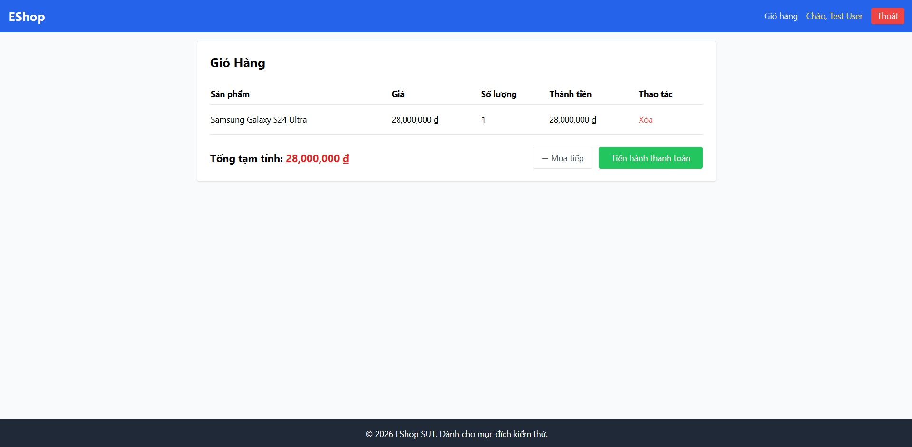

### Bug 7: Hiển thị sai nhãn tổng tiền trong Giỏ hàng ("Tổng tạm tính" thay vì "Tổng cộng")
- **Mô tả Bug:**
Đặc tả hệ thống (FR-07) quy định rất rõ ràng và nhấn mạnh việc nhãn hiển thị tổng tiền trong Giỏ hàng phải là "Tổng cộng" (tuyệt đối không dùng "Tổng tạm tính"). Tuy nhiên, trên giao diện hiện tại, mặc dù hệ thống tính toán ra số tiền chính xác, nhưng nhãn text lại đang bị hardcode sai thành "Tổng tạm tính".

- **Test Case liên quan:**
    - `TC_FR07_03`

- **Github Issues Link:** https://github.com/nguyenhieuthuan3105/EShop-Testing-HW02-Group04/issues/56
- **Ảnh minh chứng (Screenshots):**
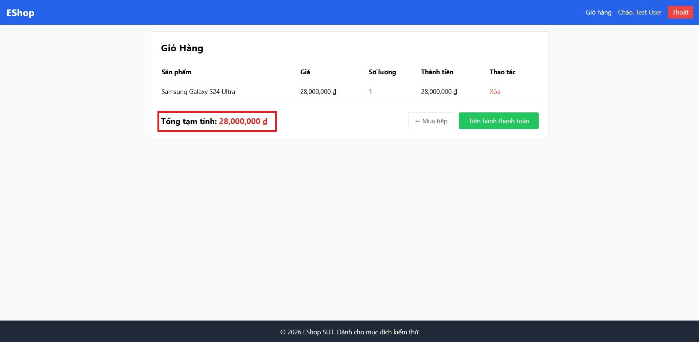

### Bug 8: Hệ thống sinh dòng mới thay vì cộng dồn số lượng khi thêm sản phẩm trùng lặp vào Giỏ hàng
- **Mô tả Bug:**
Theo đặc tả hệ thống (FR-07), khi người dùng thêm cùng một sản phẩm đã tồn tại trong giỏ hàng, hệ thống phải cập nhật tăng số lượng của dòng sản phẩm đó lên, tuyệt đối không tạo thêm dòng mới. Tuy nhiên, logic xử lý thêm vào giỏ hàng (addToCart) hiện tại đang bị sai: mỗi lần nhấn "Thêm vào giỏ" đối với một sản phẩm trùng lặp, hệ thống lại sinh ra một dòng dữ liệu hoàn toàn riêng biệt trong danh sách giỏ hàng.

- **Test Case liên quan:**
    - `TC_FR07_04`

- **Github Issues Link:** https://github.com/nguyenhieuthuan3105/EShop-Testing-HW02-Group04/issues/57
- **Ảnh minh chứng (Screenshots):**
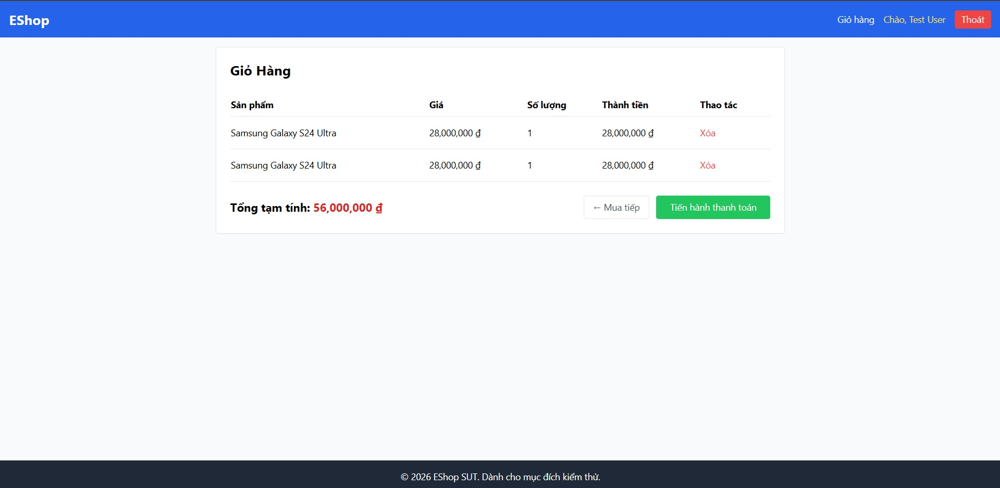

### Bug 9: Xóa sản phẩm ngay lập tức mà không hiển thị Dialog xác nhận
- **Mô tả Bug:**
Theo đặc tả hệ thống (FR-07), thao tác "Xóa sản phẩm" khỏi Giỏ hàng bắt buộc phải hiển thị một Dialog xác nhận (Confirmation Dialog) để ngăn chặn việc người dùng click nhầm. Tuy nhiên, hiện tại hệ thống đang thực thi lệnh xóa ngay lập tức (instant delete) ngay khi người dùng nhấn vào nút Xóa ở cột Thao tác. Không có bất kỳ cảnh báo hay hộp thoại nào được hiển thị, gây rủi ro mất dữ liệu giỏ hàng do vô tình thao tác sai.

- **Test Case liên quan:**
    - `TC_FR07_08`
    - `TC_FR07_09`

- **Github Issues Link:** https://github.com/nguyenhieuthuan3105/EShop-Testing-HW02-Group04/issues/58
- **Ảnh minh chứng (Screenshots):**
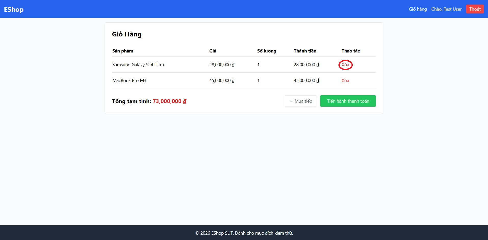

### Bug 10: Mất toàn bộ dữ liệu giỏ hàng khi làm mới (Refresh/F5) trang
- **Mô tả Bug:**
Hệ thống hiện không có cơ chế lưu trữ bền vững (State Persistence) cho dữ liệu Giỏ hàng. Khi người dùng đang có sản phẩm trong giỏ và thực hiện thao tác tải lại trang (Refresh/F5), toàn bộ dữ liệu bị xóa sạch, giỏ hàng quay về trạng thái trống trơn ban đầu. Điều này vi phạm nghiêm trọng luồng trải nghiệm mua sắm cơ bản, gây ức chế và rủi ro mất khách hàng.

- **Test Case liên quan:**
    - `TC_FR07_12`

- **Github Issues Link:** https://github.com/nguyenhieuthuan3105/EShop-Testing-HW02-Group04/issues/59
- **Ảnh minh chứng (Screenshots):**
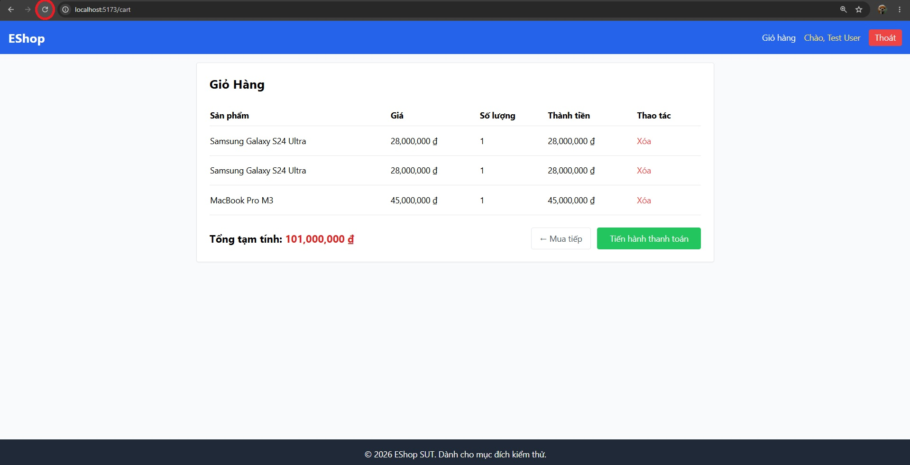
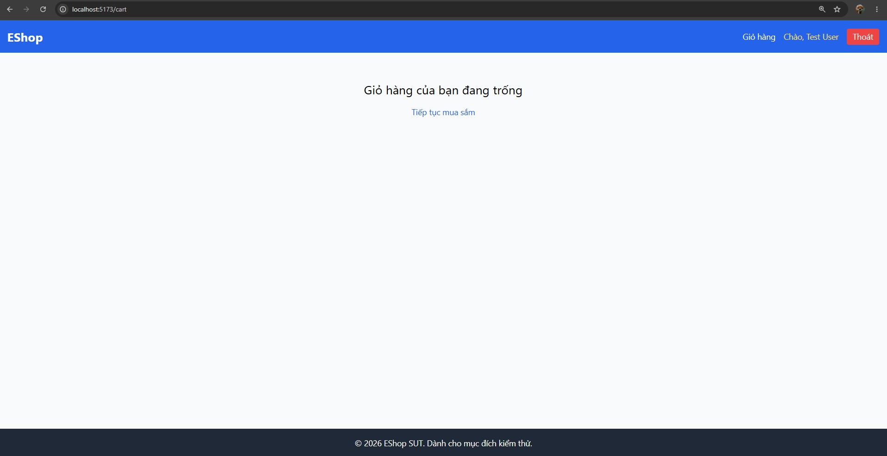

### Bug 11: Cho phép nhập số lượng sản phẩm là số âm vào Giỏ hàng
- **Mô tả Bug:**
Hệ thống hiện đang thiếu hoàn toàn cơ chế xác thực dữ liệu đối với trường Số lượng sản phẩm. Người dùng có thể cố tình nhập một số âm (Ví dụ: `-5`) khi thêm sản phẩm từ trang chi tiết Sản phẩm và hệ thống vẫn chấp nhận đưa sản phẩm đó vào Giỏ hàng.

- **Test Case liên quan:**
    - `TC_FR07_13`

- **Github Issues Link:** https://github.com/nguyenhieuthuan3105/EShop-Testing-HW02-Group04/issues/61
- **Ảnh minh chứng (Screenshots):**
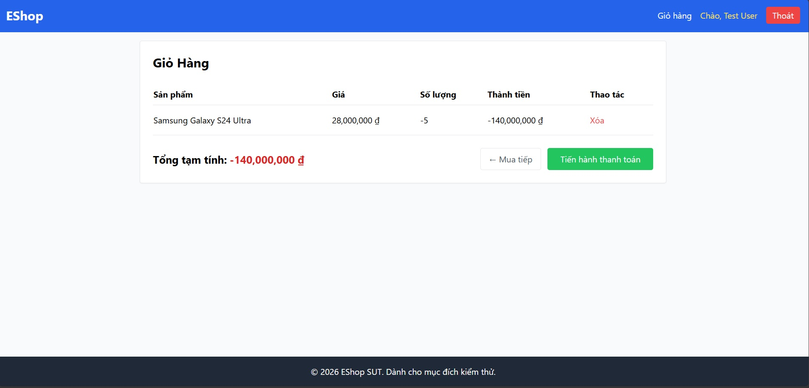

### Bug 12: Cho phép nhập và lưu Tên sản phẩm vượt quá giới hạn tối đa (255 ký tự)
- **Mô tả Bug:**
Hệ thống đang thiếu cơ chế kiểm soát giới hạn độ dài đối với trường "Tên sản phẩm". Mặc dù giới hạn chuẩn là 255 ký tự theo đặc tả (FR-15), hệ thống vẫn cho phép người dùng nhập và lưu thành công một chuỗi văn bản dài 256 ký tự (vượt quá Max).
 (Lưu ý: Hiện tại nếu tên sản phẩm quá dài, sẽ bị tình trạng gãy layout).

- **Test Case liên quan:**
    - `TC_FR15_04`

- **Github Issues Link:** https://github.com/nguyenhieuthuan3105/EShop-Testing-HW02-Group04/issues/64
- **Ảnh minh chứng (Screenshots):**
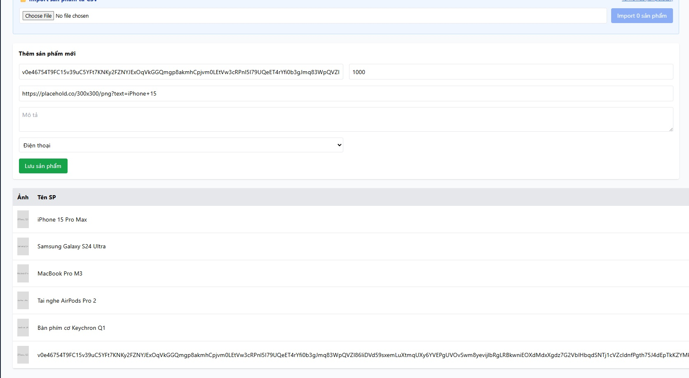
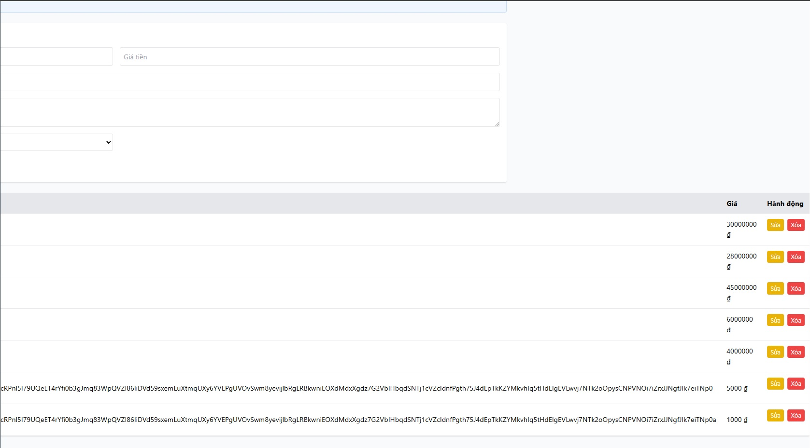

### Bug 13: Thiếu kiểm tra tính hợp lệ của trường Giá sản phẩm (Cho phép lưu giá trị 0, số âm và rỗng)
- **Mô tả Bug:**
Theo đặc tả hệ thống (FR-15), khi thêm sản phẩm, trường "Giá sản phẩm" có ràng buộc là bắt buộc nhập và phải là số dương (> 0). Tuy nhiên, hệ thống hiện tại đang thiếu hoàn toàn cơ chế xác thực cho trường dữ liệu này. Người dùng có thể cố ý bỏ trống ô nhập liệu, hoặc nhập các giá trị không hợp lệ như 0 và số âm (vd: -1), nhưng hệ thống vẫn không hề có cơ chế ngăn chặn mà trực tiếp lưu thành công vào cơ sở dữ liệu.

- **Test Case liên quan:**
    - `TC_FR15_05`
    - `TC_FR15_06`
    - `TC_FR15_07`

- **Github Issues Link:** https://github.com/nguyenhieuthuan3105/EShop-Testing-HW02-Group04/issues/65
- **Ảnh minh chứng (Screenshots):**
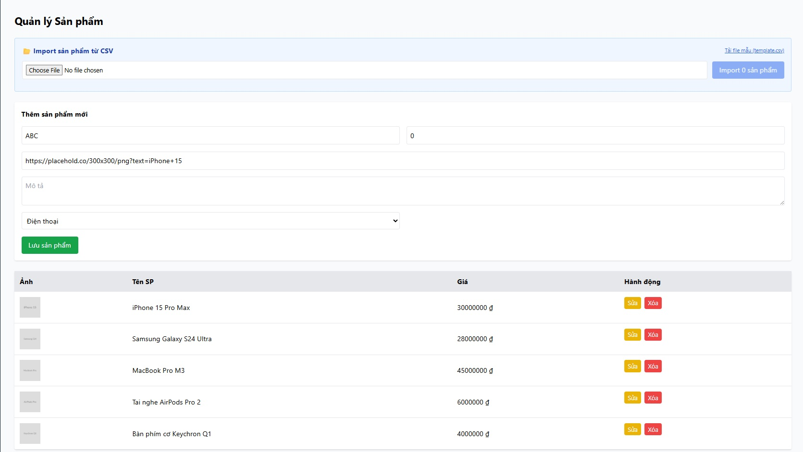
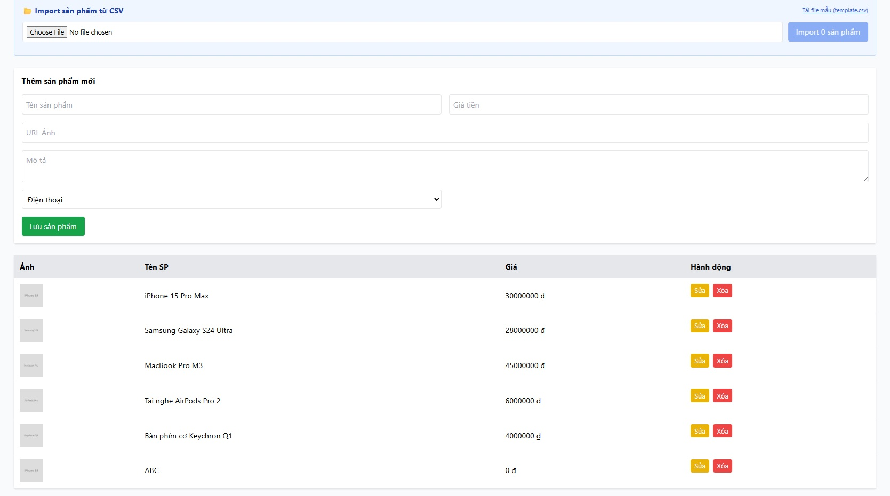
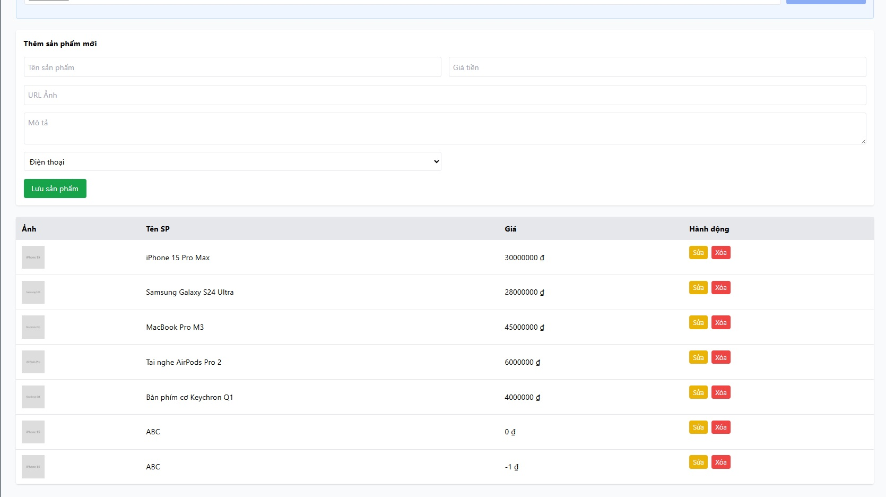
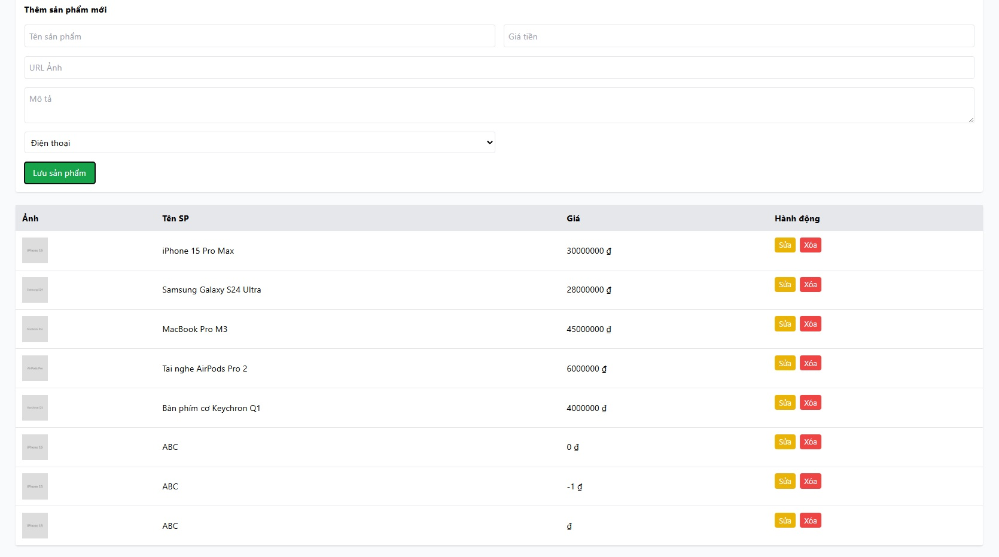

### Bug 14: Cho phép tạo Sản phẩm không thuộc Danh mục nào (Bỏ qua ràng buộc bắt buộc)
- **Mô tả Bug:**
Theo đặc tả hệ thống (FR-15), trường "Danh mục" khi tạo/sửa sản phẩm là trường bắt buộc và người dùng phải chọn từ danh sách có sẵn. Tuy nhiên, nếu hệ thống hiện tại không có danh mục nào (bị xóa sạch), hoặc người dùng bằng cách nào đó không chọn danh mục, hệ thống vẫn chấp nhận request và lưu sản phẩm thành công.

- **Test Case liên quan:**
    - `TC_FR15_09`

- **Github Issues Link:** https://github.com/nguyenhieuthuan3105/EShop-Testing-HW02-Group04/issues/66
- **Ảnh minh chứng (Screenshots):**
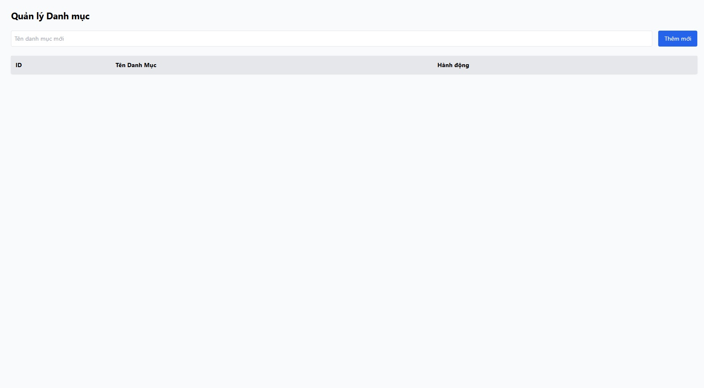
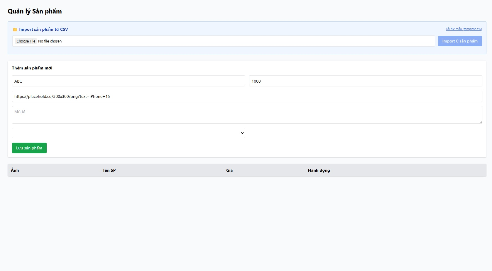
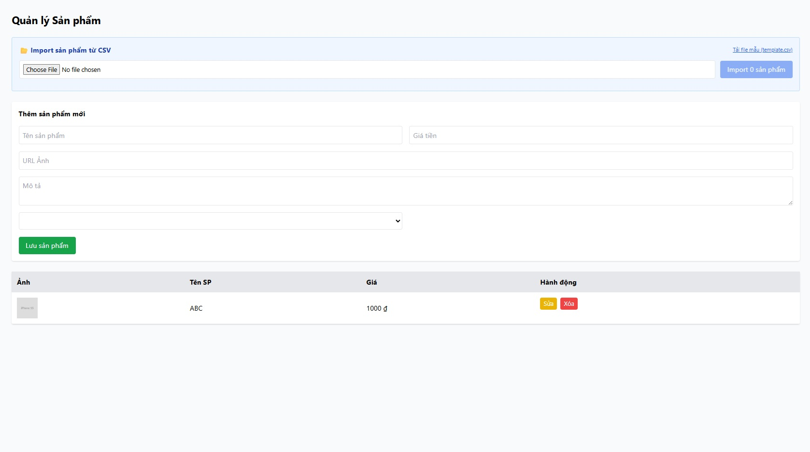

### Bug 15: Khuyết thiếu chức năng "Xem chi tiết" (Read) của sản phẩm
- **Mô tả Bug:**
Theo tiêu chuẩn quản lý CRUD được quy định trong đặc tả (FR-15), hệ thống cần cung cấp đầy đủ các thao tác cho Admin, bao gồm việc "Xem" thông tin chi tiết của một sản phẩm. Tuy nhiên, trên giao diện danh sách hiện tại hoàn toàn thiếu sót nút "Xem chi tiết" hoặc cơ chế click vào tên/ảnh để xem. Admin đang phải đi đường vòng bằng cách bấm vào nút "Sửa" để xem được các trường dữ liệu đầy đủ.

- **Test Case liên quan:**
    - `TC_FR15_10`

- **Github Issues Link:** https://github.com/nguyenhieuthuan3105/EShop-Testing-HW02-Group04/issues/67
- **Ảnh minh chứng (Screenshots):**
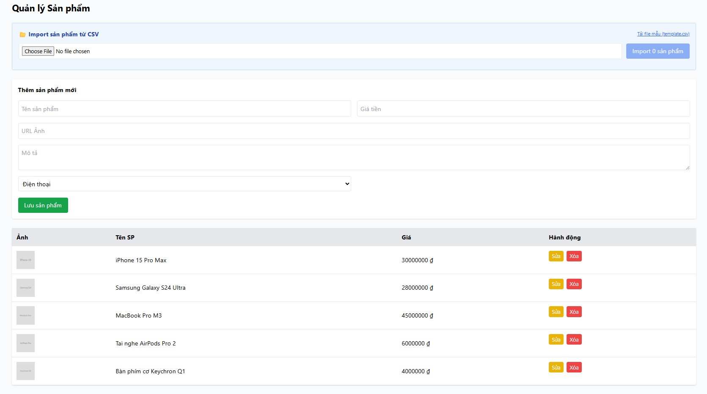

### Bug 16: Lỗi đồng bộ State: Hiển thị sai thông tin toàn bộ danh sách sau khi Sửa một sản phẩm
- **Mô tả Bug:**
Khi Admin thực hiện cập nhật thông tin (Tên và Giá) của một sản phẩm bất kỳ, giao diện Frontend xử lý sai logic cập nhật State. Cụ thể, thay vì chỉ cập nhật thông tin cho dòng sản phẩm vừa thao tác, UI lại lấy tên mới áp cho toàn bộ các sản phẩm khác trong danh sách, đồng thời bỏ sót không cập nhật trường Giá. Tuy nhiên, khi tải lại trang (F5), dữ liệu hiển thị lại chính xác như mong đợi. Điều này khẳng định API/Database vẫn xử lý đúng tính độc lập, nhưng lỗi hoàn toàn nằm ở phần đồng bộ dữ liệu sau khi submit form của Client-side.

- **Test Case liên quan:**
    - `TC_FR15_13`

- **Github Issues Link:** https://github.com/nguyenhieuthuan3105/EShop-Testing-HW02-Group04/issues/68
- **Ảnh minh chứng (Screenshots):**
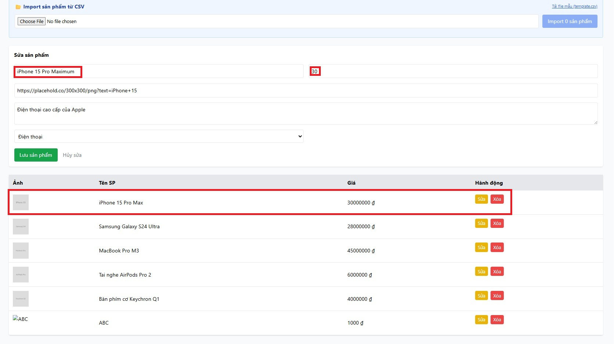
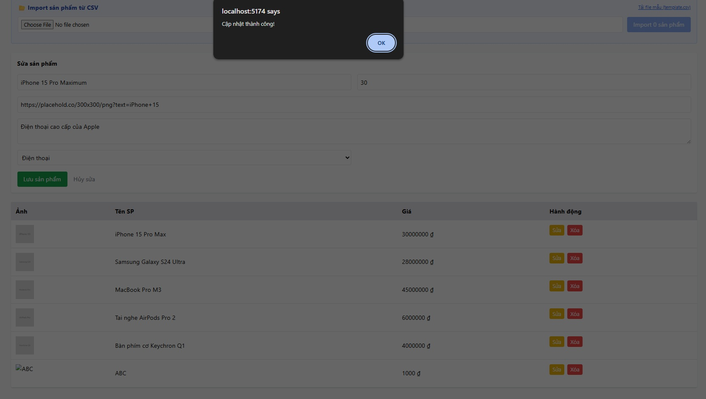
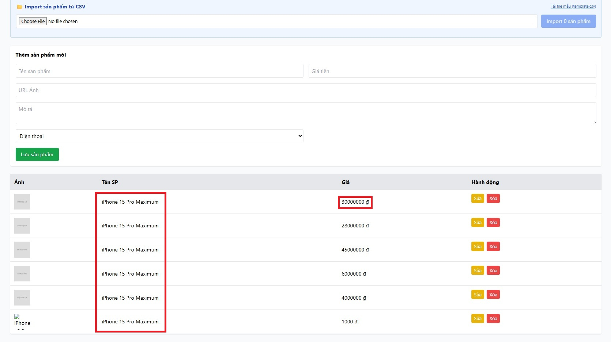

### Bug 17: Sai logic xác thực độ dài số điện thoại khi cập nhật hồ sơ (Mobile)
- **Mô tả Bug:** 
Theo đặc tả hệ thống (FR-20 - FR-04: Quản lý hồ sơ), số điện thoại hợp lệ phải bắt đầu bằng số 0 và có độ dài từ 10 đến 11 chữ số. Tuy nhiên, hệ thống hiện tại đang áp dụng sai quy tắc kiểm tra. Hệ thống liên tục trả về thông báo lỗi: "Số điện thoại không hợp lệ. Vui lòng nhập đúng 9-10 chữ số." bất kể người dùng nhập 9, 10, 11 hay 12 số và cả giá trị hợp lệ ở biên Min (10 số, bắt đầu bằng 0) cũng bị chặn. Lỗi này cũng đã báo cáo trên frontend web ở Github Issues #46 (Bug 1).

- **Test Case liên quan:**
    - `TC_FR20_01`
    - `TC_FR20_02`
    - `TC_FR20_03`
    - `TC_FR20_04`

- **Github Issues Link:** https://github.com/nguyenhieuthuan3105/EShop-Testing-HW02-Group04/issues/69
- **Ảnh minh chứng (Screenshots):**
 
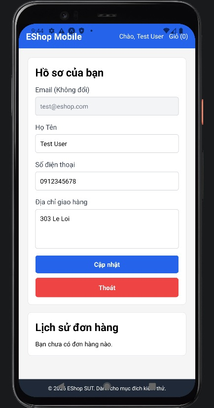

### Bug 18: Vỡ layout màn hình Hồ sơ do hiển thị text Họ tên quá dài (Mobile)
- **Mô tả Bug:**
Khi người dùng cập nhật Họ tên với một chuỗi ký tự dài (Ví dụ: chạm ngưỡng tối đa 255 ký tự), hệ thống xử lý lưu dữ liệu thành công nhưng giao diện lại khuyết thiếu cơ chế xử lý hiển thị văn bản dài (Text Truncation). Chuỗi Họ tên 255 ký tự được render tràn ra ngoài ranh giới, làm vỡ cấu trúc layout của màn hình và trực tiếp che khuất đi một phần giao diện của khu vực "Lịch sử đơn hàng" bên dưới.

- **Test Case liên quan:**
    - `TC_FR20_05`

- **Github Issues Link:** https://github.com/nguyenhieuthuan3105/EShop-Testing-HW02-Group04/issues/70
- **Ảnh minh chứng (Screenshots):** 
 
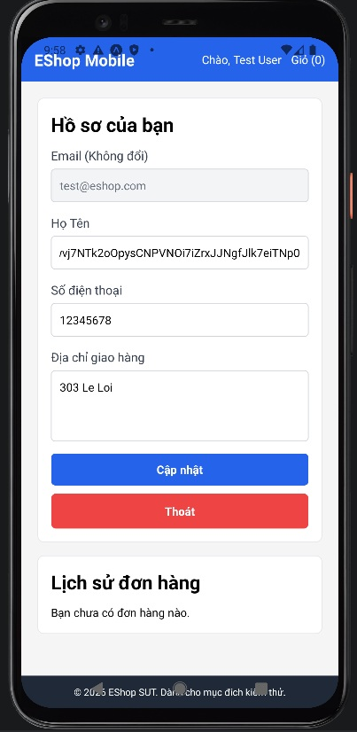
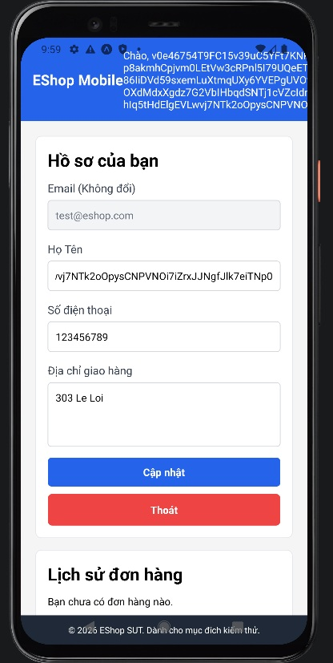

### Bug 19: Hệ thống chấp nhận lưu số điện thoại không bắt đầu bằng số 0 (Mobile)
- **Mô tả Bug:**
Theo đặc tả nghiệp vụ (FR-20 - FR-04: Quản lý hồ sơ), một trong những ràng buộc bắt buộc của trường Số điện thoại là phải bắt đầu bằng số 0. Tuy nhiên, hệ thống hiện tại đang khuyết thiếu logic kiểm tra điều kiện này. Người dùng có thể dễ dàng nhập một số điện thoại bắt đầu bằng các chữ số khác (Ví dụ: 8912345678) mà hệ thống vẫn ghi nhận là hợp lệ, trong khi các số điện thoại bắt đầu bằng số 0 thì lại không được. Lỗi này cũng đã báo cáo trên frontend web ở Github Issues #45.

- **Test Case liên quan:**
    - `TC_FR20_06`

- **Github Issues Link:** https://github.com/nguyenhieuthuan3105/EShop-Testing-HW02-Group04/issues/71
- **Ảnh minh chứng (Screenshots):**
 

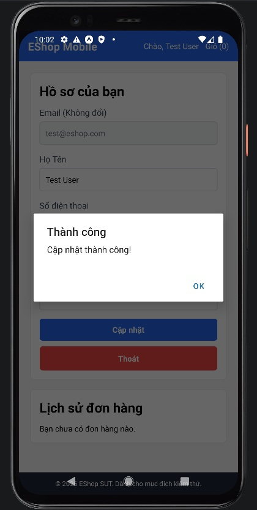

### Bug 20: Mất dữ liệu Địa chỉ giao hàng sau khi phiên đăng nhập kết thúc (Lỗi Fake Success - Mobile)
- **Mô tả Bug:**
Hệ thống gặp vấn đề nghiêm trọng trong việc lưu trữ Data đối với trường "Địa chỉ giao hàng mặc định". Khi người dùng cập nhật địa chỉ, ứng dụng thông báo thành công và hiển thị dữ liệu bình thường. Tuy nhiên, nếu người dùng đăng xuất và đăng nhập lại, trường địa chỉ này lại trở về trạng thái trống (dù trước đó trước khi đăng nhập, vào lại trang hồ sơ cá nhân vẫn còn giá trị ở trường địa chỉ).

- **Test Case liên quan:**
    - `TC_FR20_09`

- **Github Issues Link:** https://github.com/nguyenhieuthuan3105/EShop-Testing-HW02-Group04/issues/72
- **Ảnh minh chứng (Screenshots):**
 
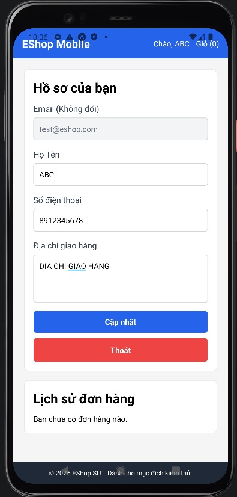
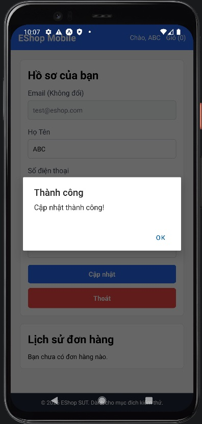
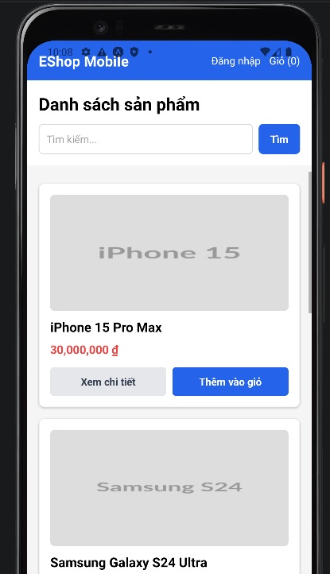
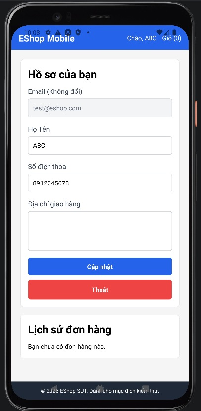

### Bug 21: Hiển thị chung một thông báo lỗi sai với độ dài số điện thoại trong đặc tả (Mobile)
- **Mô tả Bug:**
Hệ thống xử lý thông báo lỗi đang hoạt động không chính xác về mặt ngữ cảnh. Cụ thể, khi người dùng thao tác nhập liệu tại trường Số điện thoại với các độ dài khác nhau (9 số, 10 số, 11 số, 12 số), hệ thống luôn trả về một thông báo lỗi duy nhất: "Số điện thoại không hợp lệ. Vui lòng nhập đúng 9-10 chữ số".
Điều này là sai lệch hoàn toàn so với đặc tả (yêu cầu số điện thoại phải từ 10-11 chữ số), khiến người dùng bị điều hướng sai cách nhập liệu. Đáng chú ý, ngay cả khi người dùng nhập đúng độ dài (10 hoặc 11 số), hệ thống vẫn chặn và hiển thị lỗi này.

- **Test Case liên quan:**
    - `TC_FR20_01`
    - `TC_FR20_02`
    - `TC_FR20_03`
    - `TC_FR20_04`

- **Github Issues Link:** https://github.com/nguyenhieuthuan3105/EShop-Testing-HW02-Group04/issues/73
- **Ảnh minh chứng (Screenshots):**
 

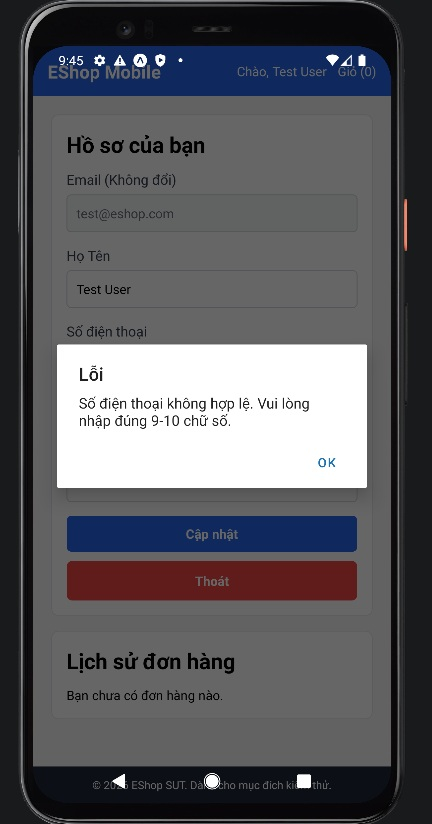
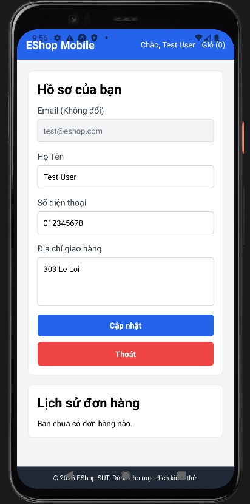
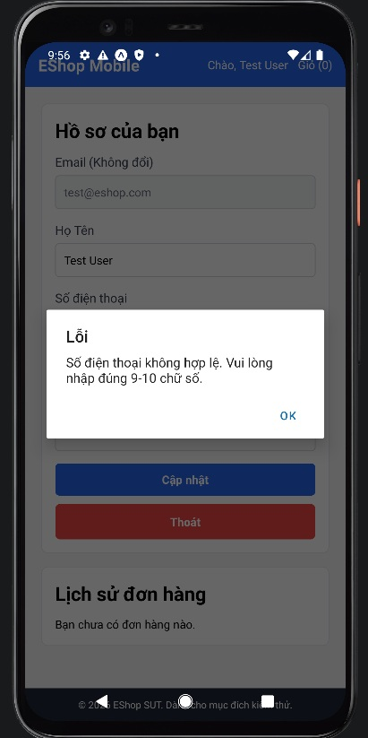